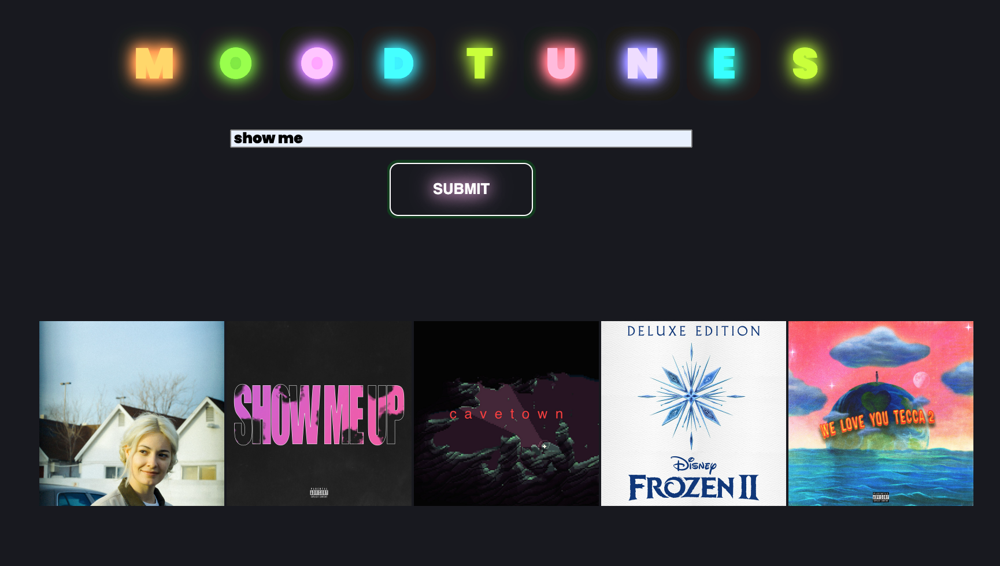

# MoodTunes

MoodTunes is a music mood classifier application. Using the Spotipy python library and Spotify Credentials to access their APIs and data acquisition, the app enables users to determine the mood of a specific track. The ‘moods’ that the tracks are categorized by are “Content”, “Calm”, “Depressed”, “Happy”, “Sad”, “Energetic” and “Frantic”. These categories were chosen based on the following [article](https://sites.tufts.edu/eeseniordesignhandbook/2015/music-mood-classification/), which breaks down moods classified according to musical components. (Source: Derived from Bhar, 2014). MoodTunes is designed to allocate the moods of a track based on Spotify's Audio Features; Acousticness, Danceability, Energy, Instrumentalness, Liveness, Loudness, Speechiness, Valence, and Tempo. In order to find the mood of a song, the user must type the title of the track into the form displayed on the homepage. The top 5 Spotify results will pop up down below as album covers. Once the user selects the track they wish to view they will be taken to a gradient that corresponds to that track's mood along with a key as reference.

# The Stack

This project was built with python, jquery, ajax, css, and html while pulling information from the spotify API. 

# Demo 

[Click Here To View Demo Video](https://www.youtube.com/watch?v=uLIeZLqDHLw)

# About the Engineer
Julia Fairbrother recently graduated with a BFA from the San Francisco Art Institute focusing on Art & Technology. While attending college, she took a number of courses focusing on art and hardware oriented languages such as Processing, Max MSP/Jitter, Javascript and Arduino. Immediately following graduation, Fairbrother worked as a Sound Design Engineer for two upcoming mobile games. In this position she navigated remote collaboration while producing and implementing the mobile apps UX/SFX. Fairbrother is a recent graduate of Hackbright Academy where she furthered her technical background around data structures and engineering. In the future, Julia hopes to connect with an established company or startup in the role of an audio data engineer/sound design engineer, being able to apply both creative and technical skills into her work.

You can find out more about me and connect professional on [LinkedIn](www.linkedin.com/in/julia-fairbrother)
